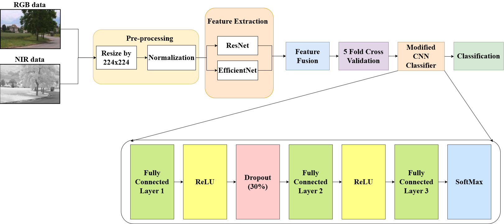

# Multi-Spectral RGB-NIR Scene Dataset Classification Using Deep Learning Models

## Overview
This project focuses on **classifying multi-spectral images** using deep learning models.  
Multi-spectral data captures images in multiple bands, such as **RGB (Red, Green, Blue)** and **NIR (Near-Infrared)**, providing richer information than standard RGB images.  
By leveraging the NIR band alongside RGB, the model can capture **hidden patterns in vegetation, surfaces, and materials** that are not visible in the standard color spectrum.  

In this project, we built a **dual-channel deep learning model** to classify scenes using both **RGB and NIR images** from the **RGB-NIR Scene Dataset**.  

---

## Project Highlights
- **Dataset:** RGB-NIR Scene Dataset with 9 scene categories  
- **Input Modalities:**  
  - RGB images  
  - NIR images (near-infrared)  
- **Approach:**  
  - Double-channel CNN based on ResNet and EfficientNet architecture  
  - Feature fusion using concatenation and fully connected layers  
  - Evaluated with accuracy, precision, recall, F1-score, and specificity  

---

## Model Architecture
Below is the architecture of the **dual-channel CNN** used for multi-spectral classification:  

---

## Results & Presentation
For **detailed experimental results and methodology**, please check the presentation included in this repository:  

**`PR Final Project_B3.pptx`** 
